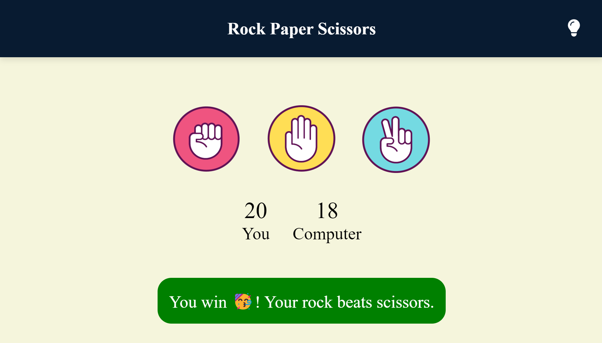
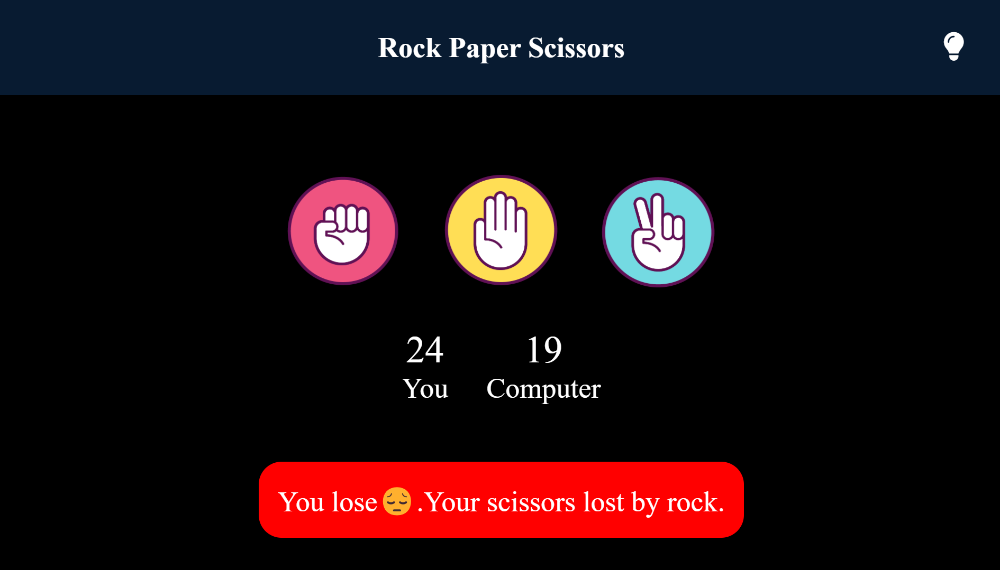

# 🎮 Rock-Paper-Scissors Game
Welcome to the Rock-Paper-Scissors game! 🤘📄✂️

## 🚀 Features
- **Interactive Gameplay**: Choose rock, paper, or scissors and play against the computer.
- **Scoreboard**: Keep track of your wins and losses.
- **Dark Mode**: Toggle between light and dark mode for a better user experience.

## 📸 Screenshots

## 📦 Installation
1. Clone the repository:
git clone https://github.com/ajinkyabh2203/rock-paper-scissors.git

2. Navigate to the project directory:
cd rock-paper-scissors

3. Open index.html in your favorite browser.

## 🕹️ How to Play
1. Click on rock, paper, or scissors to make your move.
2. The computer will randomly choose its move.
3. Check the result and see if you win, lose, or draw!
4. Toggle the lightbulb icon to switch between dark and light modes.

## 🛠️ Built With
- HTML
- CSS
- JavaScript

---

## Enjoy the game and happy playing! 🎉🕹️
